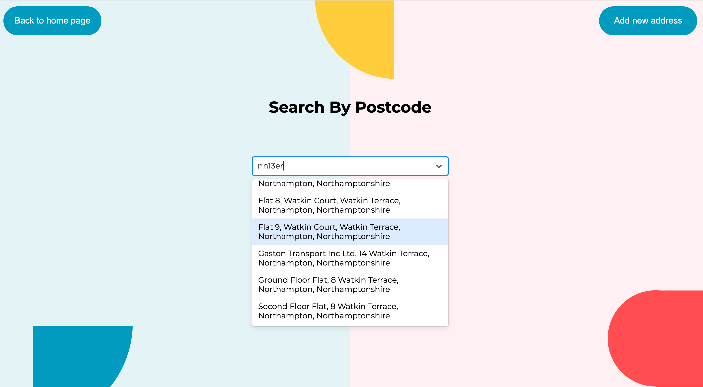
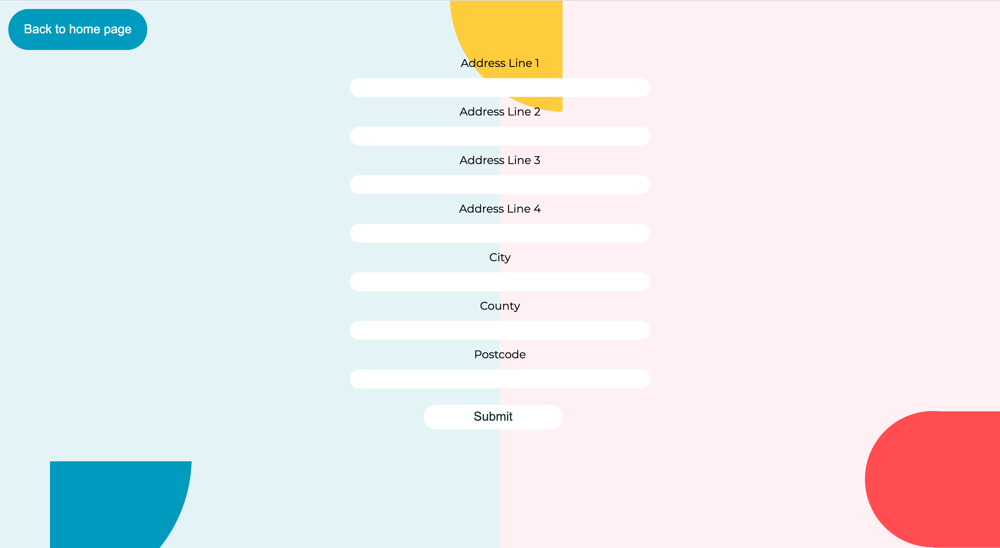

# Address Book

<div align="center">
   
   
   
   
   
</div>

<div align="center">
   
   
   
</div>

## About The App

The purpose of this app is that it allows users to search for an address via by the city or postcode.

There is also an option to add a new address if this address does not exist in the address book.

## Built With

The app has been built mainly with React and TypeScript. Express and Node.js has been used for the server. For testing, Cypress has been used.

- [React](https://reactjs.org/)
- [TypeScript](https://www.typescriptlang.org/)
- [Express](https://expressjs.com//)
- [Nodejs](https://nodejs.org/)
- [Cypress](https://www.cypress.io/)

## Getting Started

### Installation

1. Sign up and get a free API Key at [https://getaddress.io/](https://getaddress.io/)

2. Clone the repo

   ```sh
   git clone https://github.com/AnnaTran96/addresslookup
   ```

3. Install NPM packages

   ```sh
   npm install
   ```

4. Create a `.env` file in the root directory and add <i>API_KEY</i>

   ```js
   REACT_APP_API_KEY = "ENTER YOUR API KEY";
   REACT_APP_ADMINISTRATION_KEY = "ENTER YOUR ADMINISTRATION KEY";
   ```

5. Open the terminal and run `npm install` to install the dependencies

6. Then run `npm run start:node` to start the server. You should expect to see <i>"App listening at http://localhost:5000"</i>

7. Open a new terminal and run `npm start` to start the app. Head over to [https://localhost:8080/](https://localhost:8080/) to use the app

## Changelog

- Fetch data from getAdress API
- Create forms and dropdown select component
- Create reusable button components
- Create tests and add final styling
